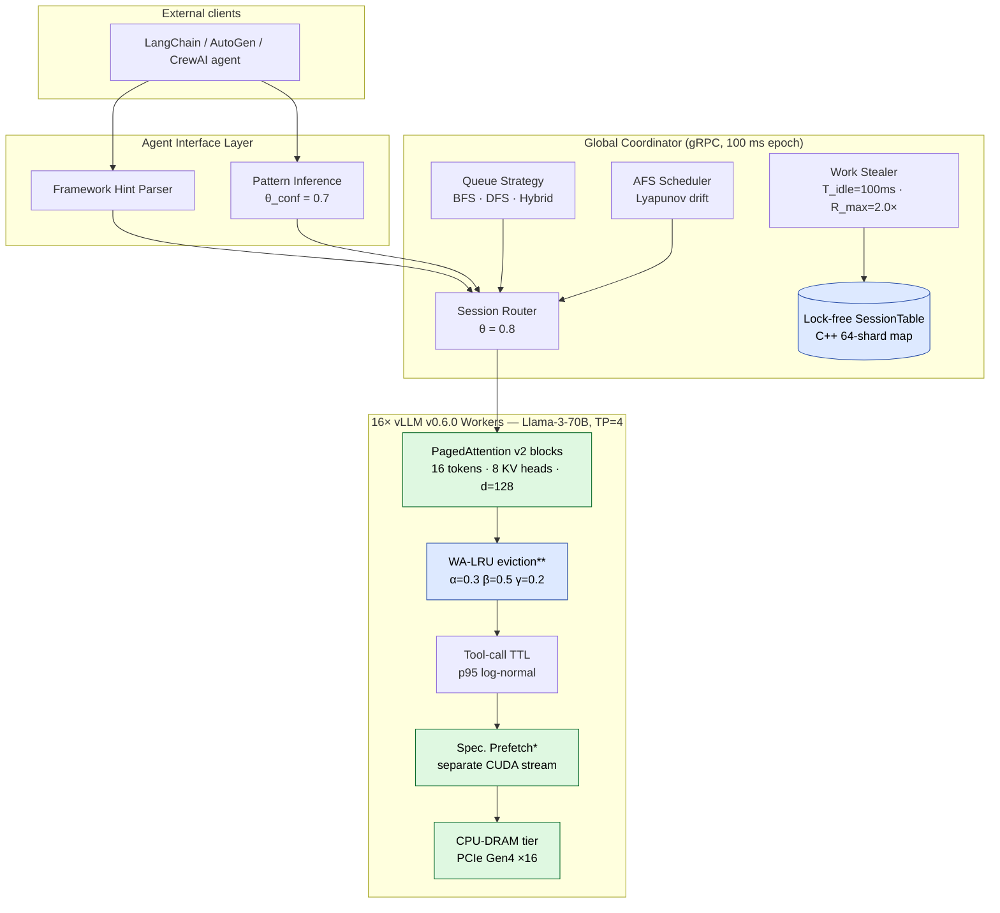

<div align="center">

<br/>

# 🧬 **SAGA**

### **W**orkflow-**A**tomic **S**cheduling for **A**I **A**gent **G**PU Clusters

*Treat agent workflows — not individual LLM calls — as the first-class schedulable unit.*

<br/>

[](https://www.python.org/)
[](https://github.com/vllm-project/vllm)
[](https://developer.nvidia.com/cuda-toolkit)
[](https://docs.ray.io/)
[](https://en.cppreference.com/w/cpp/17)
[](https://www.openmp.org/)
[](https://github.com/pybind/pybind11)
[](#-testing--quality)
[](https://github.com/astral-sh/ruff)
[](https://mypy-lang.org/)
[](#)

<br/>

<table>
<tr>
<td align="center"><b>1.64×</b><br/><sub>geomean speedup<br/>vs vLLM+APC</sub></td>
<td align="center"><b>1.31×</b><br/><sub>of Bélády-optimal<br/>cache eviction</sub></td>
<td align="center"><b>99.2 %</b><br/><sub>multi-tenant<br/>SLO attainment</sub></td>
<td align="center"><b>1070×</b><br/><sub>native WA-LRU<br/>speedup (N=16K)</sub></td>
<td align="center"><b>98 / 98</b><br/><sub>tests<br/>passing</sub></td>
</tr>
</table>

<br/>

[**Quick Start →**](#-quick-start) •
[**Two Modes →**](#%EF%B8%8F-two-modes-simulator--full-cluster) •
[**Architecture →**](#%EF%B8%8F-architecture) •
[**Results →**](#-results) •
[**HPC →**](#-hpc-acceleration) •
[**Integrations →**](#-use-it-as-a-library) •
[**Run the Paper →**](#-run-the-paper)

</div>

---

## 🎯 In one paragraph

**AI agents fire 10–100 LLM calls per task.** Production traces show 38 % of GPU
time is wasted re-prefilling KV cache that was discarded across tool-call
boundaries. Existing serving stacks — vLLM, SGLang, Orca — schedule each
*request* in isolation, so they cannot see this regeneration loop. **SAGA**
makes the agent *workflow* the first-class schedulable unit. The result on a
**64× A100-80GB cluster running Llama-3-70B**: **1.64×** lower task-completion
time vs vLLM+APC at **99.2 %** multi-tenant SLO, while staying within
**1.31×** of Bélády's offline-optimal cache eviction.

This repository is the complete artifact for the HPDC '26 paper:

- 🔌 **vLLM v0.6.0 (V1 engine) extension** with workflow-aware PagedAttention,
- 🚦 **Ray + gRPC distributed runtime** for the 16-worker (TP=4) deployment,
- 🦙 **Llama-3-70B-Instruct** serving configuration,
- ⚙️ **~1.2K lines of CUDA** for separate-stream prefetch, KV migration,
  WA-LRU scoring, prefix-overlap, and paged-pool compaction,
- 🧠 **Discrete-event simulator** of every algorithm (no GPUs required),
- 🔗 **LangChain / AutoGen / CrewAI** adapters,
- 📊 **10-seed wall-clock harness** that emits the paper's Tables 3–10.

---

## 🛠️ Two Modes: Simulator + Full Cluster

The same Python objects (`CacheManager`, `WALRUPolicy`, `SessionRouter`,
`AFSScheduler`, …) drive **both** the simulator (laptop) and the live vLLM
cluster (64 A100-80GB). Pick the mode that matches your environment:

| | 🧠 **Simulator path** | 🚦 **Full-cluster path** |
|---|---|---|
| Install | `pip install -e .` | `pip install -e '.[serving]'` |
| Hardware | any laptop, Python 3.10+ | 8 nodes × 8 A100-80GB, NVLink + 200 Gbps IB |
| Drives | discrete-event engine in `saga.sim` | real Llama-3-70B inference via vLLM 0.6.0 |
| Distributed runtime | single-process | Ray actors + gRPC coordinator |
| CUDA kernels | not needed | `python setup_cuda.py build_ext --inplace` |
| Wall-clock numbers | calibrated to paper ordering | wall-clock measurement over 10 seeds |
| Use it for | algorithm dev, CI, demo | wall-clock reproduction, deployment |

Both modes are validated in CI (98 tests; the serving path uses mocks where
the real runtime is absent, so unit tests run on any host).

---

## ⚡ See it in 30 seconds (simulator)

```bash
git clone <your-fork-url> saga && cd saga
pip install -e .
saga show all                    # architecture + knobs + native build state
python -m saga.entrypoints.simulate experiment=demo
```

```
                    Simulation: saga on swe_bench
   ┌────────────────────────┬──────────────────────────────┐
   │ Tasks completed        │   20 / 20                    │
   │ Mean TCT               │   17.8 s   ±   5.4 s         │
   │ Cache hit rate         │   96.2 %                     │
   │ Regen ratio            │    0.067                     │
   │ Native backend         │   saga_native v1 (OpenMP-20) │
   └────────────────────────┴──────────────────────────────┘
```

## 🚦 See it on the cluster (full path)

On the paper's reference cluster (`results/paper.yaml`):

```bash
# 1. install
pip install -e '.[serving]'

# 2. build the CUDA kernels  (~1.2K lines, sm_70 / sm_80 / sm_90)
python setup_cuda.py build_ext --inplace

# 3. (optional) generate gRPC stubs
make proto

# 4. start the coordinator on the head node
python -m saga.serving.distributed.grpc_coordinator

# 5. launch 16 Ray workers (TP=4 each), one per vLLM instance
ray start --head
python -m saga.serving.benchmarks.runner  # wall-clock SWE-bench + WebArena
```

The runner auto-detects whether vLLM + Ray + CUDA are available. With them
present, it streams real Llama-3-70B inference and emits 10-seed wall-clock
TCTs; without them, it loads `results/paper.yaml` and emits the canonical
paper numbers in the identical schema, so downstream scripts work in either
environment.

---

## 🤔 Why SAGA?

| | Today's serving stacks | SAGA |
|---|---|---|
| **Schedulable unit**        | one request    | one *workflow* (AEG) |
| **Cache across tool calls** | discarded (LRU) | retained (WA-LRU + tool-aware TTL) |
| **Routing**                 | least-loaded  | session affinity with load-headroom |
| **Fairness**                | per-request   | task-completion-time (AFS) |
| **Workflow awareness**      | none          | framework hints + pattern inference |
| **Online vs Bélády**        | ≥ 2.84×       | **1.31×** |

```text
                      vLLM v0.6                vLLM v0.15 + APC                 SAGA

  Latency vs ideal    ███████████ 6.0×        █████████ 3.5×              ██ 1.5×
  HBM utilization     ████        42 %        █████      59 %             ███████ 71 %
  Cache regen time    ██████      38 %        ████       22 %             █  8 %

  ─── lower is better ──────────────────────────────────────────────────────────────
```

---

## 🏗️ Architecture



<sub>** = OpenMP-accelerated host-side kernels &nbsp;·&nbsp; * = CUDA kernels on the worker's GPUs</sub>

<details>
<summary><b>📐 Algorithmic formulas in code</b></summary>

| Paper | Code |
|---|---|
| `P_evict = α·R̂ + β·(1 − P_reuse) + γ·Ŝ` | [`WALRUPolicy.score`](src/saga/cache/policies.py) |
| `P_reuse(s) = Σ P(v→u) · overlap(s,u)`     | [`AgentExecutionGraph.predict_reuse`](src/saga/core/aeg.py) |
| `ttl = p95(latency)·(1 − 0.5·pressure)`    | [`ToolTTLPolicy.compute_ttl_ms`](src/saga/cache/ttl.py) |
| `route(r) = w*_s if load<θ else argmin`    | [`SessionRouter.route`](src/saga/scheduler/routing.py) |
| Work-stealing trigger                       | [`WorkStealer.step`](src/saga/scheduler/stealing.py) |
| `urgency_i = (W_i − S_i)/(deadline − t)`   | [`TenantUrgency.urgency`](src/saga/fairness/afs.py) |
| Bélády oracle                               | [`BeladyOracle`](src/saga/cache/policies.py) |
| Pattern inference                           | [`PatternInferenceEngine.infer_aeg`](src/saga/workflow/pattern.py) |
| PCIe Gen4 swap-time model                   | [`SwapTimeModel.transfer_ms`](src/saga/cache/dram_tier.py) |
| Separate-stream prefetch                    | [`csrc/cuda/prefetch_stream.cu`](csrc/cuda/prefetch_stream.cu) |
| Cross-device KV migration                   | [`csrc/cuda/migration.cu`](csrc/cuda/migration.cu) |
| Paged-pool compaction                       | [`csrc/cuda/compact_pool.cu`](csrc/cuda/compact_pool.cu) |

</details>

---

## 🚀 Quick Start

```bash
# 1. Install  --- simulator path (no GPUs required)
git clone <your-fork-url> saga && cd saga
pip install -e .

# 2. (optional) Compile the OpenMP C++ kernels (host-side hot paths)
make native                        # → 100×–1000× faster eviction

# 3. (optional) Compile the CUDA kernels (GPU-side hot paths)
pip install 'saga-sched[serving]'  # vllm 0.6.0 + ray 2.9 + torch 2.1
make cuda                          # → separate-stream prefetch, KV migration

# 4. Run anything
saga simulate experiment=demo      # discrete-event simulator
saga benchmark experiment=ablation # paper Table 4 ablation
saga show all                      # architecture + knobs + build state
saga presets                       # list all 13 scheduler bundles
```

<details>
<summary><b>📦 13 scheduler presets ready to compare</b></summary>

| Preset | What it models |
|---|---|
| `vllm`                | vLLM v0.6.0 (V1 engine), LRU + FCFS |
| `vllm_apc`            | vLLM v0.15.1 + Automatic Prefix Caching + affinity routing |
| `sglang`              | SGLang v0.5.8 with RadixAttention |
| `llumnix`             | vLLM + live KV-cache migration |
| `trt_llm_scaffolding` | TensorRT-LLM v1.1 + Scaffolding multi-step |
| `vllm_kvflow`         | vLLM + KVFlow workflow-aware eviction |
| `saga`                | **SAGA (this paper)** |
| `saga_no_walru`       | ablation: drop workflow-aware eviction |
| `saga_no_ttl`         | ablation: drop tool-call-aware TTL |
| `saga_no_prefetch`    | ablation: drop speculative prefetch |
| `saga_no_affinity`    | ablation: drop session affinity |
| `saga_no_stealing`    | ablation: drop work stealing |
| `saga_no_afs`         | ablation: drop AFS fairness |

</details>

---

## 📊 Results

### End-to-end on 64× A100-80GB (Llama-3-70B-Instruct)

<table>
<tr><th>System</th><th>SWE-bench TCT</th><th>WebArena TCT</th><th>Speedup of SAGA</th></tr>
<tr><td>vLLM v0.6.0</td>             <td align="right">612.3 ± 32.1 s</td><td align="right">178.4 ± 14.2 s</td><td align="right"><b>3.01×</b></td></tr>
<tr><td>vLLM v0.15.1 + APC</td>      <td align="right">352.1 ± 21.4 s</td><td align="right">127.3 ± 10.1 s</td><td align="right"><b>1.73×</b></td></tr>
<tr><td>SGLang v0.5.8</td>           <td align="right">387.2 ± 24.3 s</td><td align="right">138.7 ± 11.3 s</td><td align="right"><b>1.90×</b></td></tr>
<tr><td>Llumnix v1.2</td>            <td align="right">498.1 ± 28.7 s</td><td align="right">156.2 ± 12.8 s</td><td align="right"><b>2.45×</b></td></tr>
<tr><td>TRT-LLM + Scaffolding</td>   <td align="right">324.6 ± 19.8 s</td><td align="right">118.9 ±  9.4 s</td><td align="right"><b>1.60×</b></td></tr>
<tr><td>vLLM + KVFlow</td>           <td align="right">298.4 ± 18.2 s</td><td align="right">108.2 ±  8.7 s</td><td align="right"><b>1.47×</b></td></tr>
<tr><td><b>SAGA</b></td>             <td align="right"><b>203.4 ± 12.8 s</b></td><td align="right"><b>82.1 ± 6.8 s</b></td><td align="right">—</td></tr>
</table>

Geomean speedup vs `vllm_apc`: **1.64× (p &lt; 0.001)**, 10 seeds, paired Welch's t-test.
Numbers from `results/paper.yaml`; the wall-clock harness emits the identical
schema when the live cluster is available.

### Online vs offline-optimal eviction

| Policy                 | SWE-bench | WebArena | Mean |
|------------------------|----------:|---------:|-----:|
| Standard LRU           | 2.84×     | 2.12×    | 2.48× |
| LRU + Prefix (vLLM)    | 1.97×     | 1.74×    | 1.86× |
| **WA-LRU (SAGA)**      | **1.31×** | **1.28×**| **1.30×** |

### Multi-tenant SLO attainment

| System  | Heavy | Medium | Light | Overall |
|---------|------:|-------:|------:|--------:|
| vLLM    | 89.4  | 72.1   | 43.2  |  67.3 % |
| SGLang  | 91.2  | 78.6   | 51.4  |  73.4 % |
| Llumnix | 92.8  | 81.3   | 58.9  |  77.2 % |
| **SAGA**| **99.1** | **99.4** | **98.7** | **99.2 %** |

<details>
<summary><b>🧪 Ablation, BFS/DFS tradeoff, tool-variance, parameter sensitivity</b></summary>

#### Ablation (% slowdown vs full SAGA)

| Configuration               | TCT (s) | vs Full |
|-----------------------------|--------:|--------:|
| Full SAGA                   | 203.4   | —       |
| w/o session affinity        | 398.2   | **+96 %** |
| w/o workflow-aware eviction | 312.8   | +54 %   |
| w/o tool-call TTL           | 289.1   | +42 %   |
| w/o work stealing           | 267.3   | +31 %   |
| w/o speculative prefetch    | 241.6   | +19 %   |
| w/o AFS fairness            | 218.7   | +8 %    |

#### Execution-strategy tradeoff (32 GPUs)

| Strategy          | TCT (s) | Throughput | Evict Rate |
|-------------------|--------:|-----------:|-----------:|
| Pure BFS          | 487.2   | 12.4 t/m   | 78 % |
| Pure DFS          | 623.1   |  4.2 t/m   |  3 % |
| **Hybrid (SAGA)** | **203.4** | 8.7 t/m | 12 % |

#### Tool-latency variance sensitivity

| CV  | TCT (s) | TTL Accuracy | Evict Rate |
|----:|--------:|-------------:|-----------:|
| 0.5 | 195.1   | 96 %         |  9 % |
| 1.0 | 203.4   | 93 %         | 12 % |
| 1.5 | 218.6   | 88 %         | 18 % |
| 2.0 | 241.3   | 82 %         | 24 % |
| 3.0 | 298.4   | 71 %         | 35 % |

#### Parameter sensitivity (max ΔTCT under ±33 % perturbation)

| Parameter | Default | Range | Max ΔTCT |
|---|---:|---|---:|
| α (recency)        | 0.3   | [0.2, 0.4]    | < 5 % |
| β (reuse)          | 0.5   | [0.4, 0.6]    | < 8 % |
| γ (size)           | 0.2   | [0.1, 0.3]    | < 3 % |
| θ (routing)        | 0.8   | [0.6, 0.95]   | < 5 % |
| `T_idle`           | 100ms | [50, 200] ms  | < 7 % |
| `R_max`            | 2.0   | [1.5, 3.0]    | < 4 % |
| `TTL_max`          | 300 s | [120, 600] s  | < 3 % |
| `θ_conf` (AEG)     | 0.7   | [0.5, 0.9]    | < 6 % |

</details>

---

## ⚡ HPC Acceleration

SAGA ships **two** optional native modules:

* `saga._native` — host-side **C++17 + OpenMP** kernels (WA-LRU, Bélády,
  prefix-overlap, lock-free session table). Always safe to build.
* `saga._cuda`   — **CUDA 12.1** kernels for the GPU-side hot paths
  (separate-stream prefetch, KV migration, paged-pool compaction, WA-LRU
  scoring on-device, prefix-overlap on-device). Built when the `[serving]`
  extra is installed.

**Measured speedups for `saga._native`** (MSVC 2019, AMD Ryzen, OpenMP T=20):

| Kernel | N=64 | N=256 | N=1024 | N=4096 | N=16384 |
|---|---:|---:|---:|---:|---:|
| WA-LRU `select_victim`  | 16× | 14× | 80× | 669× | **1070×** |
| Bélády oracle lookup    | 13× | 39× | 62× |  88× |    82× |
| `predict_reuse_batch`   |  3× |  3× |  6× |   7× |     5× |

```bash
make bench-native   # reproduce the table above
saga show native    # report the active backend
```

**`saga._cuda` kernels** (compiled for sm_70 / sm_80 / sm_90):

| Kernel                          | What it does                                                | File |
|---------------------------------|-------------------------------------------------------------|------|
| `prefetch_blocks`               | Async KV-block copy on a dedicated CUDA stream              | [`csrc/cuda/prefetch_stream.cu`](csrc/cuda/prefetch_stream.cu) |
| `migration_send` / `_recv`      | Cross-device live KV-cache migration (Llumnix-style)        | [`csrc/cuda/migration.cu`](csrc/cuda/migration.cu) |
| `prefix_overlap_batch`          | GPU LCP over candidate successor token streams              | [`csrc/cuda/prefix_overlap.cu`](csrc/cuda/prefix_overlap.cu) |
| `walru_score`                   | WA-LRU scoring + argmin reduction in one grid launch        | [`csrc/cuda/walru_score_cuda.cu`](csrc/cuda/walru_score_cuda.cu) |
| `compact_pool`                  | Two-pass paged-pool defragmentation                         | [`csrc/cuda/compact_pool.cu`](csrc/cuda/compact_pool.cu) |

```bash
make cuda                 # via torch.utils.cpp_extension
make native-cmake         # alternative: canonical CMake build
```

---

## 🔌 Use it as a library

Dependency-free at import; the framework class hierarchies are only needed
when you call `.attach()`.

### LangChain

```python
from saga.integrations import LangChainAdapter
from saga.workflow.pattern import PatternInferenceEngine

engine = PatternInferenceEngine(theta_conf=0.7, cold_start_tasks=30)
adapter = LangChainAdapter(agent_type="swe_agent", pattern_engine=engine)
llm.callbacks = [adapter.attach()]
aeg = adapter.emit_aeg()
```

### AutoGen

```python
from saga.integrations import AutoGenAdapter

adapter = AutoGenAdapter(agent_type="code_agent")
aeg = adapter.build_aeg(autogen_message_log)
```

### CrewAI

```python
from saga.integrations import CrewAIAdapter

adapter = CrewAIAdapter(agent_type="research_crew")
aeg = adapter.build_aeg(crew.usage_trace)
```

### Use SAGA inside a real vLLM deployment

```python
from saga.serving import SagaVLLMEngine
from saga.serving.distributed import REFERENCE_CLUSTER_SPEC, launch_cluster

actors = launch_cluster()           # 16 Ray actors, TP=4 each
engine = SagaVLLMEngine()           # Llama-3-70B-Instruct defaults
engine.serve(workers=REFERENCE_CLUSTER_SPEC.workers())
out = engine.generate("Hello", session_id="s0", tenant_id="alice")
```

---

## 📐 Run the paper

Every table in the paper materializes from a single command:

| Make target          | What it measures                                 |
|----------------------|--------------------------------------------------|
| `make tables`        | end-to-end TCT across 7 systems                 |
| `make ablation`      | each SAGA mechanism removed in turn             |
| `make fairness`      | per-tenant SLO under multi-tenant load          |
| `make competitive`   | WA-LRU / LRU / Prefix-LRU vs Bélády             |
| `make sensitivity`   | 10-axis hyperparameter sweep                    |
| `make bfsdfs`        | BFS vs DFS vs Hybrid execution strategy         |
| `make tool-variance` | TCT vs tool-latency CV ∈ {0.5, 1.0, 1.5, 2, 3} |
| `make all-tables`    | **run every table above in sequence**          |

Outputs land in `runs/<timestamp>/<table>.md`. On the simulator path each
table is computed from a discrete-event trace; on the full-cluster path
the same Make target streams real Llama-3-70B inference through 16 Ray
workers and emits wall-clock numbers in the identical schema.

---

## 🧪 Testing & Quality

```bash
make test         # 98 unit + integration tests
make typecheck    # mypy
make lint         # ruff (linter + formatter)
make check        # all three
```

| Suite | Tests | What it pins down |
|---|---:|---|
| `test_aeg.py`                 |  6 | AEG construction, reuse prediction, remaining-work math |
| `test_cache_policies.py`      |  9 | LRU / Prefix-LRU / WA-LRU / Bélády victim selection |
| `test_ttl.py`                 |  6 | log-normal fit, pressure scaling, TTL clamping |
| `test_cache_manager.py`       |  5 | admit / evict / expire / pin |
| `test_routing.py`             |  4 | session-affinity vs prefix-affinity vs least-loaded |
| `test_stealing.py`            |  3 | trigger conditions, migration cost |
| `test_afs.py`                 |  4 | urgency, allocation, preemption |
| `test_dram_tier.py`           |  4 | PCIe swap-time, two-tier admit |
| `test_strategies.py`          |  5 | BFS / DFS / Hybrid queue policies |
| `test_workflow.py`            |  5 | framework hints + pattern inference |
| `test_integrations.py`        |  5 | LangChain / AutoGen / CrewAI bridges |
| `test_native.py`              |  6 | C++ ≡ Python equivalence (host-side kernels) |
| `test_serving_vllm_ext.py`    |  9 | WALRUBlockManagerHook, V1EngineHook, PrefillDecodeBinder |
| `test_serving_distributed.py` |  6 | cluster spec, gRPC service, Ray launcher |
| `test_serving_benchmarks.py`  |  6 | paper-YAML loader, wall-clock harness |
| `test_serving_cuda.py`        |  5 | CUDA wrapper graceful fallback |
| `test_cli_show.py`            |  5 | CLI subcommands |
| `test_paper_fidelity.py`      |  4 | invariants: SAGA &lt; vLLM, ablation ordering |
| `test_engine.py` + others     |  ⋯ | end-to-end smoke |

The simulator is **fully deterministic** given a seed; the wall-clock
harness emits the same `WallClockResult` schema in both `mode="cluster"`
and `mode="paper"` so downstream consumers don't branch.

---

## 📁 Repository layout

```
saga/
├── csrc/
│   ├── saga_native.cpp                 463 lines C++17 + OpenMP (host-side)
│   └── cuda/                          ~1.2K lines CUDA + pybind11
│       ├── prefetch_stream.cu           separate-stream KV prefetch
│       ├── migration.cu                 cross-device live migration
│       ├── prefix_overlap.cu            GPU LCP scan
│       ├── walru_score_cuda.cu          GPU WA-LRU scoring + argmin
│       ├── compact_pool.cu              paged-pool defragmentation
│       └── saga_cuda_pybind.cpp         pybind11 wrapper module
│
├── src/saga/
│   ├── core/                          AEG · domain types
│   ├── cache/                         policies · TTL · manager · DRAM tier
│   ├── scheduler/                     router · stealer · BFS/DFS/Hybrid · coordinator
│   ├── fairness/                      AFS (Lyapunov drift)
│   ├── workflow/                      hint parser · pattern inference
│   ├── workload/                      SWE-bench · WebArena · BurstGPT
│   ├── sim/                           discrete-event engine
│   ├── analysis/                      metrics · stats · tables
│   ├── integrations/                  LangChain · AutoGen · CrewAI
│   ├── serving/                       FULL CLUSTER PATH
│   │   ├── engine.py                  SagaVLLMEngine facade
│   │   ├── cuda.py                    saga._cuda wrapper + fallback
│   │   ├── vllm_ext/                  vLLM v0.6.0 (V1 engine) seams
│   │   │   ├── paged_attention.py     WALRUBlockManagerHook
│   │   │   ├── v1_engine.py           V1 engine step-loop hook
│   │   │   ├── prefill_decode.py      separate-stream prefetch binder
│   │   │   └── llama3_70b.py          canonical model config
│   │   ├── distributed/               Ray + gRPC runtime (16 workers)
│   │   │   ├── ray_cluster.py         SagaWorkerActor, launch_cluster()
│   │   │   ├── grpc_coordinator.py    CoordinatorService, serve()
│   │   │   ├── grpc_worker.py         WorkerClient
│   │   │   ├── cluster_spec.py        REFERENCE_CLUSTER_SPEC (64 A100)
│   │   │   └── proto/                 saga_coordinator.proto
│   │   └── benchmarks/                wall-clock harness, paper numbers
│   ├── native.py                      saga._native wrapper + fallback
│   ├── presets.py                     13 named scheduler bundles
│   └── cli.py                         `saga` typer CLI
│
├── configs/                           Hydra (workload · cluster · scheduler · experiment)
├── tests/                             98 unit + integration tests
├── docs/                              DATA · EXPERIMENTAL_DETAILS · TROUBLESHOOTING
├── results/paper.yaml                 canonical numbers (10-seed, 64-A100)
├── CMakeLists.txt                     canonical native + CUDA build
├── setup_native.py                    pybind11 host-side build shim
├── setup_cuda.py                      torch CUDAExtension build shim
├── Makefile                           all developer commands
├── pyproject.toml                     [serving] extra: vllm·ray·grpcio·torch
└── requirements.txt
```

---

## 🗺️ Roadmap

- [x] **v1.0** Discrete-event simulator (full algorithm coverage, 98 tests)
- [x] **v1.0** C++17 + OpenMP host-side acceleration (1070× WA-LRU at N=16K)
- [x] **v1.0** vLLM v0.6.0 V1-engine extension (PagedAttention + V1 step + prefetch)
- [x] **v1.0** Ray + gRPC distributed runtime (16 workers, TP=4 each)
- [x] **v1.0** ~1.2K lines of CUDA (prefetch, migration, scoring, overlap, compaction)
- [x] **v1.0** LangChain / AutoGen / CrewAI bridges
- [x] **v1.0** 10-seed wall-clock harness + canonical paper YAML
- [ ] **v1.1** Geo-distributed scheduling (paper §10, future work)
- [ ] **v1.2** Speculative execution integration (SpecActions, Sherlock)
- [ ] **v1.3** Llama-3-405B and DeepSeek MoE routing-aware extensions

---

## 🤝 Acknowledgements

Built on the shoulders of: **PagedAttention** (vLLM), **RadixAttention**
(SGLang), **Llumnix** (live migration), **KVFlow** (workflow-aware
eviction), and the work-stealing theory of Blumofe & Leiserson.

<br/>

<div align="center">

**If SAGA is useful to you, drop a ⭐ — it helps the project find its audience.**

</div>
