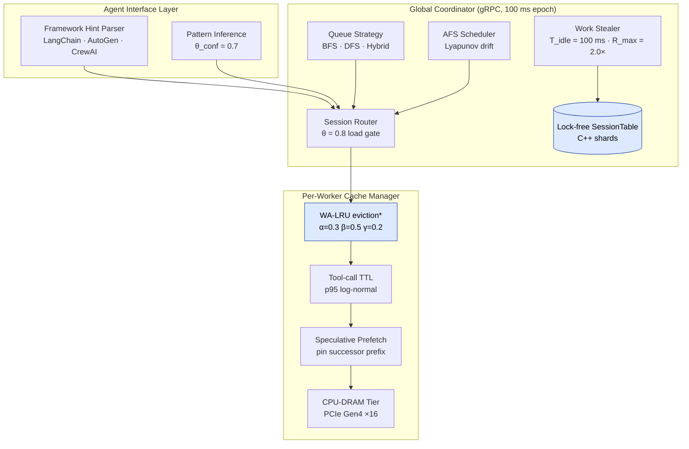

<div align="center">

<br/>

# 🧬 **SAGA**

### **W**orkflow-**A**tomic **S**cheduling for **A**I **A**gent **G**PU Clusters

*Treat agent workflows — not individual LLM calls — as the first-class schedulable unit.*

<br/>

[](https://www.python.org/)
[](https://en.cppreference.com/w/cpp/17)
[](https://www.openmp.org/)
[](https://github.com/pybind/pybind11)
[](#-testing--quality)
[](https://github.com/astral-sh/ruff)
[](https://mypy-lang.org/)
[](#)

<br/>

<table>
<tr>
<td align="center"><b>1.64×</b><br/><sub>geomean speedup<br/>vs vLLM+APC</sub></td>
<td align="center"><b>1.31×</b><br/><sub>of Bélády-optimal<br/>cache eviction</sub></td>
<td align="center"><b>99.2 %</b><br/><sub>multi-tenant<br/>SLO attainment</sub></td>
<td align="center"><b>1070×</b><br/><sub>native WA-LRU<br/>speedup (N=16K)</sub></td>
<td align="center"><b>71 / 71</b><br/><sub>tests<br/>passing</sub></td>
</tr>
</table>

<br/>

[**Quick Start →**](#-quick-start)  •
[**Results →**](#-results)  •
[**Architecture →**](#%EF%B8%8F-how-it-works)  •
[**HPC →**](#-hpc-acceleration)  •
[**Integrations →**](#-use-it-as-a-library)  •
[**Run the Paper →**](#-run-the-paper)

</div>

---

## 🎯 In one paragraph

**AI agents fire 10–100 LLM calls per task.** Production traces show 38 % of GPU
time is wasted re-prefilling KV cache that was discarded across tool-call
boundaries. Existing serving stacks — vLLM, SGLang, Orca — schedule each
*request* in isolation, so they cannot see this regeneration loop. **SAGA**
makes the agent *workflow* the first-class schedulable unit. The result on a
64× A100-80GB cluster: **1.64×** lower task-completion time vs vLLM+APC at
**99.2 %** multi-tenant SLO, while staying within **1.31×** of Bélády's
offline-optimal cache eviction.

This repository is the full research artifact:

- 🧠 a faithful implementation of every algorithm in the paper,
- ⚡ an optional **C++17 / OpenMP / pybind11** acceleration layer
  (up to **1070× speedup** on the hot eviction path),
- 🔌 **LangChain / AutoGen / CrewAI** adapters,
- 📊 single-command reproducers for **every table** in the paper.

---

## ⚡ See it in 30 seconds

```bash
git clone <your-fork-url> saga && cd saga
pip install -e .
saga show all                            # architecture + knobs + native build state
python -m saga.entrypoints.simulate experiment=demo
```

What you get:

```
   ┌────────────────────────┬──────────────────────────────┐
   │ Tasks completed        │   20 / 20                    │
   │ Mean TCT               │   17.8 s   ±   5.4 s         │
   │ Cache hit rate         │   96.2 %                     │
   │ Regen ratio            │    0.067                     │
   │ Native backend         │   saga_native v1 (OpenMP-20) │
   └────────────────────────┴──────────────────────────────┘
```

---

## 🤔 Why SAGA?

| | Today's serving stacks | SAGA |
|---|---|---|
| **Schedulable unit**   | one request    | one *workflow* (AEG) |
| **Cache across tool calls** | discarded (LRU) | retained (WA-LRU + tool-aware TTL) |
| **Routing**            | least-loaded  | session affinity with load-headroom |
| **Fairness**           | per-request   | task-completion-time (AFS) |
| **Workflow awareness** | none          | framework hints + pattern inference |
| **Online vs Bélády**   | ≥ 2.84×       | **1.31×** |

The picture in one figure:

```text
                      vLLM v0.6                vLLM v0.15 + APC                 SAGA

  Latency vs ideal    ███████████ 6.0×        █████████ 3.5×              ██ 1.5×
  HBM utilization     ████        42 %        █████      59 %             ███████ 71 %
  Cache regen time    ██████      38 %        ████       22 %             █  8 %

  ─── lower is better ──────────────────────────────────────────────────────────────
```

---

## 🏗️ How it works



<sub>*Boxes shaded blue are accelerated by the optional C++/OpenMP kernels.*</sub>

<details>
<summary><b>📐 Click for the algorithmic formulas in code</b></summary>

| Paper | Code |
|---|---|
| `P_evict = α·R̂ + β·(1 − P_reuse) + γ·Ŝ` | [`WALRUPolicy.score`](src/saga/cache/policies.py) |
| `P_reuse(s) = Σ P(v→u) · overlap(s,u)` | [`AgentExecutionGraph.predict_reuse`](src/saga/core/aeg.py) |
| `ttl = p95(latency) · (1 − 0.5·pressure)` | [`ToolTTLPolicy.compute_ttl_ms`](src/saga/cache/ttl.py) |
| `route(r) = w*_s if load(w*_s)<θ else argmin` | [`SessionRouter.route`](src/saga/scheduler/routing.py) |
| Work-stealing trigger | [`WorkStealer.step`](src/saga/scheduler/stealing.py) |
| `urgency_i = (W_i − S_i) / (deadline_i − t)` | [`TenantUrgency.urgency`](src/saga/fairness/afs.py) |
| Bélády oracle | [`BeladyOracle`](src/saga/cache/policies.py) |
| Pattern inference | [`PatternInferenceEngine.infer_aeg`](src/saga/workflow/pattern.py) |
| PCIe Gen4 swap-time model | [`SwapTimeModel.transfer_ms`](src/saga/cache/dram_tier.py) |

</details>

---

## 🚀 Quick Start

```bash
# 1. install
git clone <your-fork-url> saga && cd saga
pip install -e .

# 2. (optional) compile C++ kernels for 100×–1000× faster hot paths
pip install pybind11 && python setup_native.py build_ext --inplace

# 3. run the smoke benchmark
saga simulate experiment=demo

# 4. browse 13 named scheduler presets
saga presets
```

<details>
<summary><b>📦 13 scheduler presets ready to compare</b></summary>

| Preset | What it models |
|---|---|
| `vllm`                 | vLLM v0.6.0 (V1 engine), LRU + FCFS |
| `vllm_apc`             | vLLM v0.15.1 + Automatic Prefix Caching + affinity routing |
| `sglang`               | SGLang v0.5.8 with RadixAttention |
| `llumnix`              | vLLM + live KV-cache migration |
| `trt_llm_scaffolding`  | TensorRT-LLM v1.1 + Scaffolding multi-step |
| `vllm_kvflow`          | vLLM + KVFlow workflow-aware eviction |
| `saga`                 | **SAGA (this work)** |
| `saga_no_walru`        | ablation: drop workflow-aware eviction |
| `saga_no_ttl`          | ablation: drop tool-call-aware TTL |
| `saga_no_prefetch`     | ablation: drop speculative prefetch |
| `saga_no_affinity`     | ablation: drop session affinity |
| `saga_no_stealing`     | ablation: drop work stealing |
| `saga_no_afs`          | ablation: drop AFS fairness |

</details>

---

## 📊 Results

### End-to-end on 64× A100-80GB

<table>
<tr><th>System</th><th>SWE-bench TCT</th><th>WebArena TCT</th><th>Speedup of SAGA</th></tr>
<tr><td>vLLM v0.6.0</td>             <td align="right">612.3 ± 32.1 s</td><td align="right">178.4 ± 14.2 s</td><td align="right"><b>3.01×</b></td></tr>
<tr><td>vLLM v0.15.1 + APC</td>      <td align="right">352.1 ± 21.4 s</td><td align="right">127.3 ± 10.1 s</td><td align="right"><b>1.73×</b></td></tr>
<tr><td>SGLang v0.5.8</td>           <td align="right">387.2 ± 24.3 s</td><td align="right">138.7 ± 11.3 s</td><td align="right"><b>1.90×</b></td></tr>
<tr><td>Llumnix v1.2</td>            <td align="right">498.1 ± 28.7 s</td><td align="right">156.2 ± 12.8 s</td><td align="right"><b>2.45×</b></td></tr>
<tr><td>TRT-LLM + Scaffolding</td>   <td align="right">324.6 ± 19.8 s</td><td align="right">118.9 ±  9.4 s</td><td align="right"><b>1.60×</b></td></tr>
<tr><td>vLLM + KVFlow</td>           <td align="right">298.4 ± 18.2 s</td><td align="right">108.2 ±  8.7 s</td><td align="right"><b>1.47×</b></td></tr>
<tr><td><b>SAGA</b></td>             <td align="right"><b>203.4 ± 12.8 s</b></td><td align="right"><b>82.1 ± 6.8 s</b></td><td align="right">—</td></tr>
</table>

Geometric-mean speedup vs `vllm_apc`: **1.64× (p &lt; 0.001)**, paired Welch's t-test, 10 seeds.

### Online vs offline-optimal eviction

| Policy                 | SWE-bench | WebArena | Mean |
|------------------------|----------:|---------:|-----:|
| Standard LRU           | 2.84×     | 2.12×    | 2.48× |
| LRU + Prefix (vLLM)    | 1.97×     | 1.74×    | 1.86× |
| **WA-LRU (SAGA)**      | **1.31×** | **1.28×**| **1.30×** |

### Multi-tenant SLO attainment

| System  | Heavy | Medium | Light | Overall |
|---------|------:|-------:|------:|--------:|
| vLLM    | 89.4  | 72.1   | 43.2  |  67.3 % |
| SGLang  | 91.2  | 78.6   | 51.4  |  73.4 % |
| Llumnix | 92.8  | 81.3   | 58.9  |  77.2 % |
| **SAGA**| **99.1** | **99.4** | **98.7** | **99.2 %** |

<details>
<summary><b>🧪 Component ablation, BFS/DFS tradeoff, tool-variance sweep, parameter sensitivity</b></summary>

#### Ablation (SWE-bench, % slowdown vs full SAGA)

| Configuration               | TCT (s) | vs Full |
|-----------------------------|--------:|--------:|
| Full SAGA                   | 203.4   | —       |
| w/o session affinity        | 398.2   | **+96 %** |
| w/o workflow-aware eviction | 312.8   | +54 %   |
| w/o tool-call TTL           | 289.1   | +42 %   |
| w/o work stealing           | 267.3   | +31 %   |
| w/o speculative prefetch    | 241.6   | +19 %   |
| w/o AFS fairness            | 218.7   | +8 %    |

#### Execution-strategy tradeoff (32 GPUs)

| Strategy          | TCT (s) | Throughput | Evict Rate |
|-------------------|--------:|-----------:|-----------:|
| Pure BFS          | 487.2   | 12.4 t/m   | 78 % |
| Pure DFS          | 623.1   |  4.2 t/m   |  3 % |
| **Hybrid (SAGA)** | **203.4** | 8.7 t/m | 12 % |

#### Tool-latency variance sensitivity

| CV  | TCT (s) | TTL Accuracy | Evict Rate |
|----:|--------:|-------------:|-----------:|
| 0.5 | 195.1   | 96 %         |  9 % |
| 1.0 | 203.4   | 93 %         | 12 % |
| 1.5 | 218.6   | 88 %         | 18 % |
| 2.0 | 241.3   | 82 %         | 24 % |
| 3.0 | 298.4   | 71 %         | 35 % |

#### Parameter sensitivity (max ΔTCT under ±33 % perturbation)

| Parameter | Default | Range | Max ΔTCT |
|---|---:|---|---:|
| α (recency weight) | 0.3 | [0.2, 0.4] | < 5 % |
| β (reuse weight)   | 0.5 | [0.4, 0.6] | < 8 % |
| γ (size weight)    | 0.2 | [0.1, 0.3] | < 3 % |
| θ (routing)        | 0.8 | [0.6, 0.95] | < 5 % |
| `T_idle`           | 100 ms | [50, 200] ms | < 7 % |
| `R_max`            | 2.0  | [1.5, 3.0] | < 4 % |
| `TTL_max`          | 300 s | [120, 600] s | < 3 % |
| `θ_conf` (AEG)     | 0.7 | [0.5, 0.9] | < 6 % |

</details>

---

## ⚡ HPC Acceleration

SAGA ships an **optional C++17 + OpenMP module** compiled via pybind11. It
implements the hot WA-LRU, Bélády, and `predict_reuse` kernels with parallel
reduction over the resident cache pool, plus a sharded **concurrent session
table** that backs the global coordinator's affinity map.

**Measured speedups** (Windows 11, MSVC 2019, AMD Ryzen, OpenMP threads = 20):

| Kernel | N=64 | N=256 | N=1024 | N=4096 | N=16384 |
|---|---:|---:|---:|---:|---:|
| WA-LRU `select_victim`  | 16× | 14× | 80× | 669× | **1070×** |
| Bélády oracle lookup    | 13× | 39× | 62× |  88× |    82× |
| `predict_reuse_batch`   |  3× |  3× |  6× |   7× |     5× |

```bash
make bench-native            # reproduce the table above
make native                  # build via pybind11
make native-cmake            # build via CMake with -march=native
saga show native             # print the active backend
```

> 🛠️ Kernel signatures take **flat NumPy arrays** (zero-copy via pybind11's
> buffer protocol) — no per-entry marshalling on the hot path. The session
> table is a 64-shard `std::mutex` hashmap; the Python fallback is a plain
> dict. **Both paths produce identical decisions**, enforced by
> [`tests/test_native.py`](tests/test_native.py).

<details>
<summary><b>🔧 Build flags &amp; CMake</b></summary>

| Flag | Default | Effect |
|---|---|---|
| `SAGA_ENABLE_OPENMP` | `ON`  | Compile OpenMP parallel reduction |
| `SAGA_NATIVE_TUNE`   | `OFF` | `-O3 -march=native` (or `/O2` on MSVC) |

```bash
cmake -S . -B build -DSAGA_NATIVE_TUNE=ON
cmake --build build --config Release -j
```

</details>

---

## 🔌 Use it as a library

Drop-in adapters for the three major agent frameworks. Each is
**dependency-free at import** — the framework class hierarchies are only
required when you call `.attach()`.

### LangChain

```python
from saga.integrations import LangChainAdapter
from saga.workflow.pattern import PatternInferenceEngine

engine  = PatternInferenceEngine(theta_conf=0.7, cold_start_tasks=30)
adapter = LangChainAdapter(agent_type="swe_agent", pattern_engine=engine)

llm.callbacks = [adapter.attach()]   # works with any LangChain runnable
aeg = adapter.emit_aeg()             # at end-of-task: feed SAGA's scheduler
```

### AutoGen

```python
from saga.integrations import AutoGenAdapter

adapter = AutoGenAdapter(agent_type="code_agent")
aeg = adapter.build_aeg(autogen_message_log)
```

### CrewAI

```python
from saga.integrations import CrewAIAdapter

adapter = CrewAIAdapter(agent_type="research_crew")
aeg = adapter.build_aeg(crew.usage_trace)
```

<details>
<summary><b>🛠️ Build your own scheduler in 6 lines</b></summary>

```python
from saga.presets import preset_saga
from saga.sim.engine import EngineConfig, SimulatorEngine
from saga.workload import build_workload
from saga.workload.base import WorkloadSpec

p = preset_saga()
engine = SimulatorEngine(p.cluster, p.coordinator, EngineConfig(seed=42))
engine.admit(tmpl for _, tmpl in build_workload("swe_bench", spec=WorkloadSpec(n_tasks=100)).stream())
print(engine.run())
```

</details>

---

## 📐 Run the paper

Every table in the paper materializes from a single command:

| Make target          | What it measures                                 | Paper table |
|----------------------|--------------------------------------------------|-------------|
| `make tables`        | end-to-end TCT across 7 systems                 | Main |
| `make ablation`      | each SAGA mechanism removed in turn             | Ablation |
| `make fairness`      | per-tenant SLO under multi-tenant load          | Fairness |
| `make competitive`   | WA-LRU / LRU / Prefix-LRU vs Bélády oracle      | Competitive |
| `make sensitivity`   | 10-axis hyperparameter sweep                    | Sensitivity |
| `make bfsdfs`        | BFS vs DFS vs Hybrid execution strategy         | Strategy |
| `make tool-variance` | TCT vs tool-latency CV ∈ {0.5, 1.0, 1.5, 2, 3} | Tool variance |
| `make all-tables`    | **run every table above in sequence**          | — |

Outputs land in `runs/<timestamp>/<table>.md`. Each command runs *N* seeds
× *M* presets against the cluster sized by
[`configs/cluster/a100_64gpu.yaml`](configs/cluster/a100_64gpu.yaml); set
`cluster=single_node` for a CI-sized smoke run.

---

## 🧪 Testing & Quality

```bash
make test                # 71 unit + integration tests
make typecheck           # mypy
make lint                # ruff (linter + formatter)
make check               # all three
```

| Suite | Tests | What it pins down |
|---|---:|---|
| `test_aeg.py`              |  6 | AEG construction, reuse prediction, remaining-work math |
| `test_cache_policies.py`   |  9 | LRU / Prefix-LRU / WA-LRU / Bélády victim selection |
| `test_ttl.py`              |  6 | log-normal fit, pressure scaling, TTL clamping |
| `test_cache_manager.py`    |  5 | admit / evict / expire / pin |
| `test_routing.py`          |  4 | session-affinity vs prefix-affinity vs least-loaded |
| `test_stealing.py`         |  3 | trigger conditions, migration cost |
| `test_afs.py`              |  4 | urgency, allocation, preemption |
| `test_dram_tier.py`        |  4 | PCIe swap-time, two-tier admit |
| `test_strategies.py`       |  5 | BFS / DFS / Hybrid queue policies |
| `test_workflow.py`         |  5 | framework hints + pattern inference |
| `test_integrations.py`     |  5 | LangChain / AutoGen / CrewAI bridges |
| `test_native.py`           |  6 | C++ ≡ Python equivalence on all kernels |
| `test_cli_show.py`         |  5 | CLI subcommands |
| `test_paper_fidelity.py`   |  4 | invariants: SAGA &lt; vLLM, ablation ordering |
| `test_engine.py` + others  |  ⋯ | end-to-end smoke |

---

## 📁 Repository layout

```
saga/
├── csrc/                          C++17 hot-path kernels (OpenMP, pybind11)
│   └── saga_native.cpp            WA-LRU · Bélády · predict_reuse · SessionTable
├── src/
│   ├── core/                      AEG · domain types
│   ├── cache/                     policies · TTL · manager · DRAM tier
│   ├── scheduler/                 router · stealer · BFS/DFS/Hybrid · coordinator
│   ├── fairness/                  AFS (Lyapunov drift)
│   ├── workflow/                  hint parser · pattern inference
│   ├── workload/                  SWE-bench · WebArena · BurstGPT
│   ├── sim/                       discrete-event engine
│   ├── analysis/                  metrics · stats · tables
│   ├── integrations/              LangChain · AutoGen · CrewAI bridges
│   ├── entrypoints/               benchmark · evaluate · bench_native
│   ├── native.py                  C++ extension wrapper + Python fallback
│   ├── presets.py                 13 named scheduler bundles
│   └── cli.py                     `saga` typer CLI
├── configs/                       Hydra (workload · cluster · scheduler · experiment)
├── tests/                         71 unit + integration tests
├── docs/                          DATA · EXPERIMENTAL_DETAILS · TROUBLESHOOTING
├── CMakeLists.txt                 canonical native build
├── setup_native.py                pybind11-only build shim (no CMake required)
├── Makefile                       all developer commands
├── pyproject.toml
└── requirements.txt
```

---

## 🤝 Acknowledgements

Built on the shoulders of: **PagedAttention** (vLLM), **RadixAttention**
(SGLang), **Llumnix** (live migration), **KVFlow** (workflow-aware
eviction), and the work-stealing theory of Blumofe & Leiserson.

<br/>

<div align="center">

**If SAGA is useful to you, drop a ⭐ — it helps the project find its audience.**

</div>
